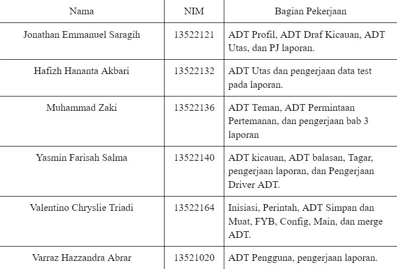

<!-- Improved compatibility of back to top link: See: https://github.com/othneildrew/Best-README-Template/pull/73 -->
<a name="readme-top"></a>
<!--
*** Thanks for checking out the Best-README-Template. If you have a suggestion
*** that would make this better, please fork the repo and create a pull request
*** or simply open an issue with the tag "enhancement".
*** Don't forget to give the project a star!
*** Thanks again! Now go create something AMAZING! :D
-->


<!-- PROJECT SHIELDS -->
<!--
*** I'm using markdown "reference style" links for readability.
*** Reference links are enclosed in brackets [ ] instead of parentheses ( ).
*** See the bottom of this document for the declaration of the reference variables
*** for contributors-url, forks-url, etc. This is an optional, concise syntax you may use.
*** https://www.markdownguide.org/basic-syntax/#reference-style-links
-->


<!-- PROJECT LOGO -->
<br />
<div align="center">
    
</div>

<h3 align="center">BurBir</h3>

  <p align="center">
    Asocial media platform using Abstract Data Types
    <br />
    <a href="https://github.com/ValentinoTriadi/TugasBesar_IF2110_2023_A"><strong>Explore the docs »</strong></a>
    ·
    <a href="https://github.com/ValentinoTriadi/TugasBesar_IF2110_2023_A/issues">Report Bug</a>
    <br/>
  </p>
</div>


<!-- TABLE OF CONTENTS -->
<details>
  <summary>Table of Contents</summary>
  <ol>
    <li>
      <a href="#about-the-project">About The Project</a>
      <ul>
        <li><a href="#built-with">Built With</a></li>
        <li><a href="#features">Built With</a></li>
      </ul>
    </li>
    <li>
      <a href="#getting-started">Getting Started</a>
      <ul>
        <li><a href="#prerequisites">Prerequisites</a></li>
        <li><a href="#HOW TO USE">HOW TO USE</a></li>
      </ul>
    </li>
    <li><a href="#usage">Usage</a></li>
    <li><a href="#Project-Status">Project Status</a></li>
    <li><a href="#Room-for-Improvement">Room for Improvement</a></li>
    <li><a href="#Acknowledgments">Acknowledgments</a></li>
    <li><a href="#Pembagian Tugas">Pembagian Tugas</a></li>
  </ol>
</details>


<!-- ABOUT THE PROJECT -->
## About The Project


Welcome to BurBir, the innovative social platform that revolutionizes the way you connect and make new friends. At BurBir, we harness the power of advanced structured programming and Abstract Data Types to offer you a seamless, intuitive experience. With just a simple gesture, our platform bridges the gap between you and a world of potential connections. We're committed to creativity and continually seek innovative solutions to enrich your social media experience, making it more effortless and enjoyable than ever.

<br/>
<strong>Our Mission</strong>

Our mission at BurBir is to enhance your social media experience by introducing groundbreaking features. We leverage the sophistication of abstract data types and structured programming to develop tools that are not only innovative but also highly practical. Our commitment is to continually evolve and provide you with an unparalleled digital interaction platform.

<br/>
<strong>Inovational Burbir</strong>

Transforming the world through technology, we present a program that connects you globally with just a simple touch of your finger. At BurBir by Cintaku Bersemi di Burbir, we're elevating the social media experience to unprecedented heights. Your experience is our top priority, and we're dedicated to consistently delivering excellence. Join us in this journey as we redefine connectivity, ensuring that each interaction on our platform is not just a moment, but an unforgettable experience crafted just for you.

<br/>
<strong>Key Features:</strong>

* Kicau: Elevating your tweeting experience to new heights with BurBir. With Kicau, dive into a world of enriched communication, where safety and superior user experience go hand in hand, making every tweet a step towards a more connected and responsible digital community.
* Utas : Creating your thread easily and fun with BurBir
* Teman : Bridging distances and fostering global connections. Our platform empowers you to seamlessly connect with people from every corner of the world. It's more than just a network; it's a gateway to diverse cultures, ideas, and friendships. With Teman, the entire world is just a click away, bringing you closer to a vast community of global voices and experiences.

<br/>
<strong>Why is BurBir better?</strong>

* Fast and Precise : With our Abstract Data Type and Structured Program, BurBir will deivered informationa and messeges you need for just a blink of an eye
* Safety : Burbir is using a password verification to make sure the safety of our user private and personal data.
* Fun To Use : With complete features, bringing the best expirienced for our user. 

Your greatest social media experienced starts at BurBir, where every Kicau is a history and every connection makes the future.
<p align="right">(<a href="#readme-top">back to top</a>)</p>


### Built With

[![C][logo-c]][github-url]

<br/>

### Features

* Profil
* Kicau
* Teman
* Utas
* For Your BurBir

<p align="right">(<a href="#readme-top">back to top</a>)</p>


<!-- GETTING STARTED -->
## Getting Started

### Prerequisites
* wsl
  
```sh
  wsl --install
```  

* gcc
  
```sh
  sudo apt install gcc
```  

* make
  
```sh
  sudo apt install make
```  


### HOW TO USE
1. Clone the repo
   
```sh
   git clone git@github.com:ValentinoTriadi/TugasBesar_IF2110_2023_A.git
```   

2. Open WSL
   
```sh
   wsl --set-default-version 2
```   

3. cd src
   
```sh
   cd src
```   

4. Make
   
```sh
   make
```   

5. Input User
```sh
    Masukkan nama folder yang akan di load sebelum menjalankan program
```


<br/>
<br/>

<p align="right">(<a href="#readme-top">back to top</a>)</p>


<!-- PROJECT STATUS -->
## Project Status
Project status: complete 
<br/>
<p align="right">(<a href="#readme-top">back to top</a>)</p>

<!-- ROOM FOR IMPROVEMENT -->
## Room for Improvement
Room for improvement:
- Improve feature accessibility
- Improve data based
- Improve user interface and experience
<br/>
<p align="right">(<a href="#readme-top">back to top</a>)</p>

<!-- ACKNOWLEDGMENTS -->
## Acknowledgments
* [Jonathan Emmanuel Saragih](https://github.com/JonathanSaragih)

* [Hafizh Hananta Akbari](https://github.com/Hapish)

* [Muhammad Zaki](https://github.com/mzaki9)

* [Yamin Farisah Salma](https://github.com/caernations)

* [Valentino Chryslie Triadi](https://github.com/ValentinoTriadi)

* [Varraz Hazzandra Akbar](https://github.com/kurovura)


<p align="right">(<a href="#readme-top">back to top</a>)</p>

## Pembagian Tugas


<!-- MARKDOWN LINKS & IMAGES -->
<!-- https://www.markdownguide.org/basic-syntax/#reference-style-links -->
[logo-c]:https://img.shields.io/badge/language-C-blue
[github-url]: https://github.com/ValentinoTriadi/TugasBesar_IF2110_2023_A